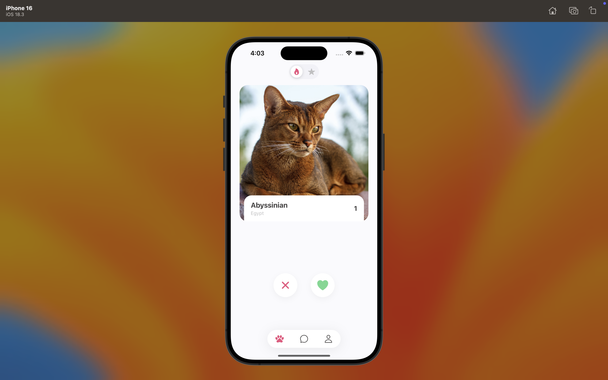
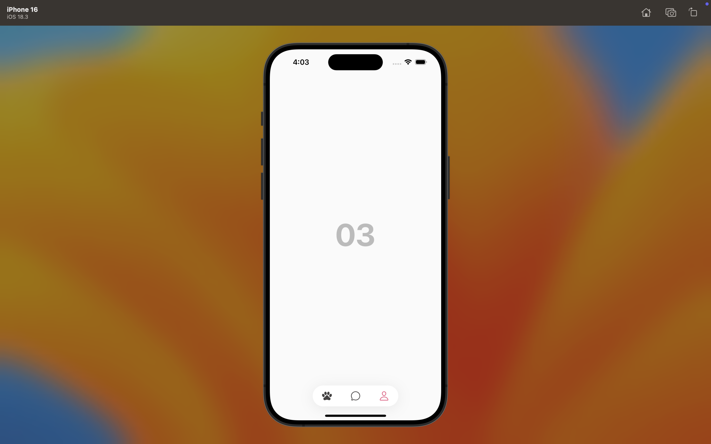

# Cat Tinder App

A Tinder-style cat app built with React Native, Expo, and TypeScript.

## Features

- Swipeable cat cards with smooth animations
- Like/Pass voting system
- Integration with The Cat API
- Responsive design optimized for mobile
- Unit tests included

## Installation

1. Clone the repository
2. Install dependencies: `npm install`
3. Start the development server: `npm start`

## Testing

Run tests with: `npm test`

## Architecture

- **Components**: Reusable UI components
- **Hooks**: Custom hooks for data fetching and state management
- **Services**: API integration layer
- **Types**: TypeScript type definitions
- **Screens**: Main app screens

## Performance Optimizations

- Memoized components to prevent unnecessary re-renders
- Efficient image loading and caching
- Smooth animations with React Native Reanimated
- Optimized gesture handling with React Native Gesture Handler

## 📸 Screenshots

Here are some screenshots of the Cat Tinder app:

### 🐾 Home Screen

### 😻

### 🐱

